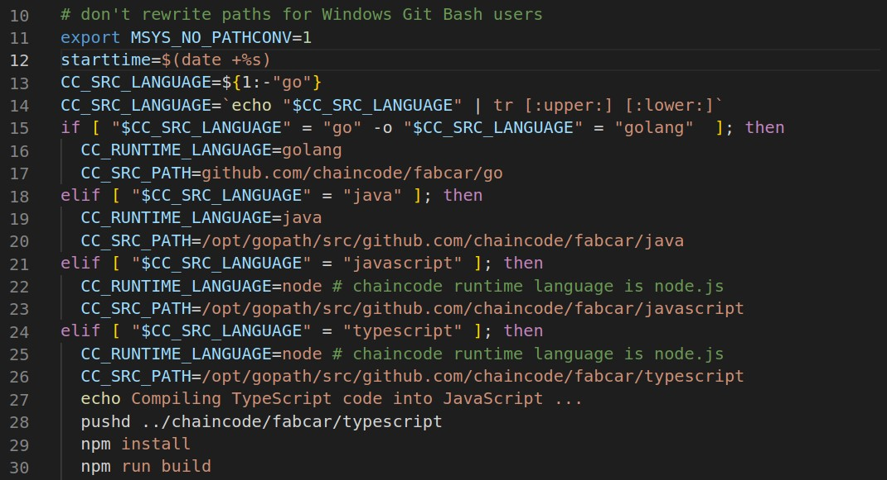

# Hyperledger Fabric Installation

Hey there! This is <a href="https://www.linkedin.com/in/rohit-patil-06a5261b6/" target="_blank">Rohit Patil</a> . Welcome to the Hyperledger Fabric installation guide that's as easy as telling a joke and its the only Hyperledger Fabric Installation that you need! Before we get started with installation guide for Hyperledger Fabric, I have a quick request. If you find this guide useful why not give this repository a star⭐🤩? which is present at top-right of screen. It's like giving me a virtual high-five, and we could all use a little extra encouragement these days. And how about connecting on [LinkedIn](https://www.linkedin.com/in/rohit-patil-06a5261b6/)?

This must be done in **Ubuntu Terminal** :

Let's start with some harmless fun - we're going to make /etc/hosts a little more open-minded. Don't worry, we're not trying to change its political views or anything, we're just giving it some extra permissions. So, type in the following commands one by one:


```
sudo chmod 666 /etc/hosts
sudo chmod 777 /etc/hosts
```
Now that we've convinced /etc/hosts to be a little more flexible, let's introduce it to some new friends. The first one is called curl, and it's great at fetching things from the internet. We'll use it to install some necessary packages. Type in:


```
sudo apt install curl 

```
Now that curl has introduced us to some new friends, let's invite them over for a little party. We can install them separately, or we can use a single command to bring them all together:

```
sudo apt-get install git docker.io docker-compose nodejs npm 
sudo chmod 777 /var/run/docker.sock
```
Now that our new friends are all settled in, it's time to introduce them to our project. We're going to clone it from GitHub using the following commands:

```
git config --global core.autocrlf false
 
```
Now, it's time to run the script that will get things rolling:

```
sudo curl -sSL http://bit.ly/2ysbOFE | bash -s 1.4.4
```
Once the script is done, we'll head over to our new project folder and create our first network. It's like having a housewarming party, but for a new network:

```
cd fabric-samples/first-network
```
```
fabric-samples/first-network$ ./byfn.sh generate
fabric-samples/first-network$ ./byfn.sh up
```

Wait for the BIG END in your terminal and that's it! You've successfully installed Hyperledger Fabric, and you've had a few laughs along the way. Remember to always treat your files with kindness and understanding, and they'll return the favor. Happy blockchain-ing!


# Chaincode Execution

When you go into the directory of fabric-samples/chaincode, you will get wide range of sample chaincodes available to execute.

```console
$ cd fabric-samples/chaincode
$ ls
abac  chaincode_example02  fabcar  marbles02  marbles02_private  sacc

```
Chaincode example of fabcar. Go into ```fabric-samples/chaincode/fabcar/javascript``` Directory.
```console
fabric-samples/chaincode/fabcar/javascript$ ls
index.js  lib  node_modules  package.json

fabric-samples/chaincode/fabcar/javascript/lib$
fabcar.js
```


You can view this chaincode in your IDE (vs code) or using ```vi fabcar.js```

Now cd back to ```fabric-sample```.

For sample we will use the Fabcar chaincode. MAKE SURE you are in ```fabric-samples/fabcar``` directory.

```console
$ cd fabric-samples/fabcar
$ ls
java  javascript  javascript-low-level  startFabric.sh  typescript

```
You can use any of your preferred language to write Chaincode(aka Smart Contract).
To select the preferred vi or you can open your VS code or any IDE.

```
fabric-samples/fabcar$ vi startFabric.sh

```
In line no. 13, change the language in ```CC_SRC_LANGUAGE=${1:-"go"}``` to your preferred language. For example I want to change it to javascript so it will be ```CC_SRC_LANGUAGE=${1:-"javascript"}```




 Now you can execute the chaincode following the below commands after running,
 ```
 fabric-samples/fabcar$ sudo ./startFabric.sh

 ```
 After execution of this script you can run the following command to execute transaction.
 ```console
 JavaScript:

  Start by changing into the "javascript" directory:
    cd javascript

  Next, install all required packages:
    npm install

  Then run the following applications to enroll the admin user, and register a new user
  called user1 which will be used by the other applications to interact with the deployed
  FabCar contract:
    node enrollAdmin
    node registerUser

  You can run the invoke application as follows. By default, the invoke application will
  create a new car, but you can update the application to submit other transactions:
    node invoke

  You can run the query application as follows. By default, the query application will
  return all cars, but you can update the application to evaluate other transactions:
    node query
```
